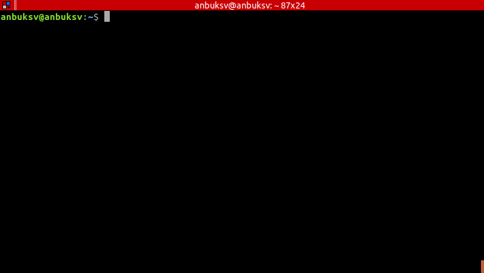

# awesome-movies

awesome-movies is a command line tool for searching movies online and get torrent link. It reads from stdin,
prints to stdout.

## Install

Direct downloads are available through the [releases page](https://github.com/anbuksv/awesome-movies/releases/latest).


## Quick start

```bash
$ movies the dark knight
```

## Basic Usage

```bash
$ movies [flags] '[movie name]'
```
## Examples



## Roadmap
- [x] yts
- [ ] Tamilrockers

## Flags

Run `movies --help` for a list of further options